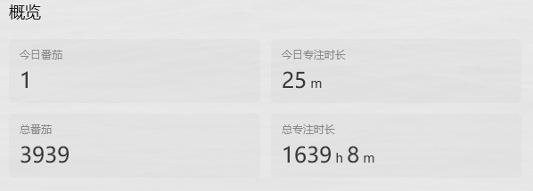

# 番茄专注

## 概览

> https://api.dida365.com/api/v2/pomodoros/statistics/generalForDesktop

*请求的方式：GET*

*请求体：无*

*响应体：JSON*

```json
{
  "todayPomoCount": 1,
  "todayPomoDuration": 25,
  "totalPomoCount": 3939,
  "totalPomoDuration": 98348
}
```

截图:



*成功响应体体字段说明*

| 字段名               | 值 | 作用           |
|-------------------|---|--------------|
| todayPomoCount    |   | 今天番茄数量       |
| todayPomoDuration |   | 今天番茄专注时长(分钟) |
| totalPomoCount    |   | 总共番茄数量       |
| totalPomoDuration |   | 总共番茄专注市场(分钟) |


