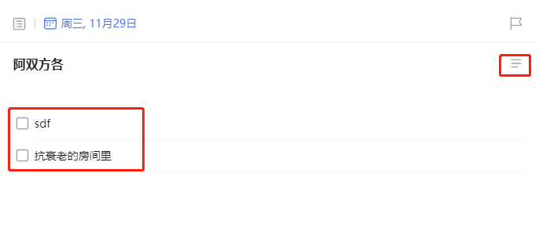
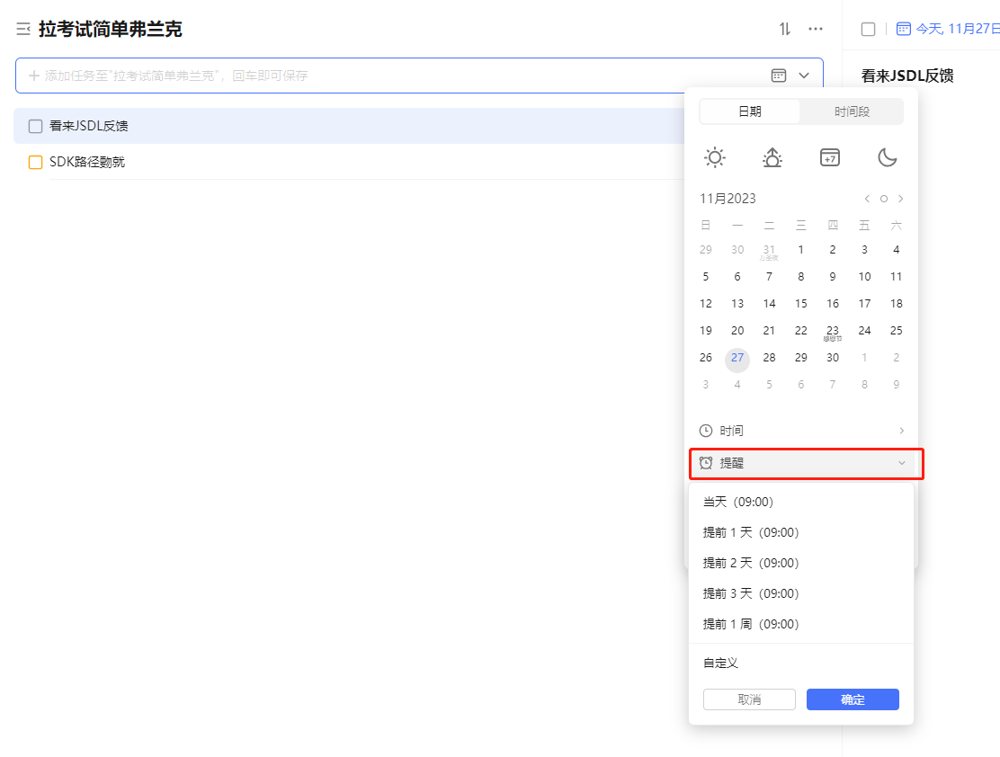
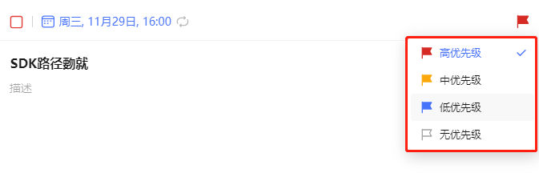
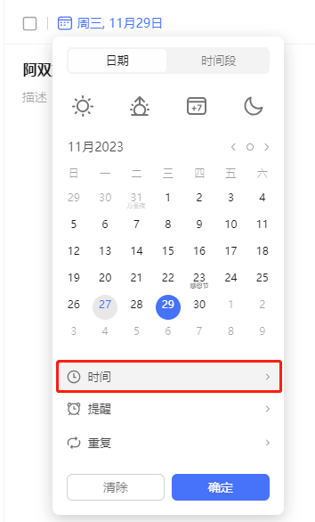
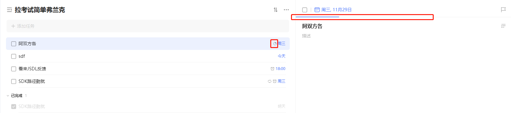

# 待定

## task_item信息

添加任务时各个参数介绍

### items

对应 `详情(子任务)`


例子:

```json
{
  "add": [],
  "update": [
    {
      "items": [
        {
          "id": "65645ed2b984e1762c1df526",
          "status": 1,
          "title": "抗衰老的房间里",
          "sortOrder": 0,
          "completedTime": "2023-11-27T09:32:58.491+0000"
        },
        {
          "id": "65645edfb984e1762c1df52e",
          "title": "sdf",
          "status": 0,
          "sortOrder": -1099511627776,
          "completedTime": null
        }
      ],
      "reminders": [],
      "exDate": [],
      "dueDate": null,
      "repeatFirstDate": "2023-11-28T16:00:00.000+0000",
      "priority": 0,
      "isAllDay": true,
      "repeatFlag": null,
      "progress": 50,
      "assignee": null,
      "sortOrder": -4398046511104,
      "startDate": "2023-11-28T16:00:00.000+0000",
      "isFloating": false,
      "completedUserId": null,
      "desc": "",
      "reminder": null,
      "remindTime": null,
      "status": 0,
      "projectId": "656430cfe4b07d442e260ea3",
      "kind": "CHECKLIST",
      "etag": "e2bkhxl9",
      "createdTime": "2023-11-27T08:47:32.000+0000",
      "modifiedTime": "2023-11-27T09:32:58.000+0000",
      "title": "阿双方各",
      "completedTime": null,
      "tags": [],
      "timeZone": "Asia/Shanghai",
      "content": "",
      "id": "656457a4b984e1762c1df4d5"
    }
  ],
  "delete": [],
  "addAttachments": [],
  "updateAttachments": [],
  "deleteAttachments": []
}
```

| 参数名           | 值 | 必要性 | 作用 |
|---------------|---|-----|----|
| id            |   |     |    |
| status        |   |     |    |
| title         |   |     |    |
| sortOrder     |   |     |    |
| completedTime |   |     |    |

### reminders

对应`提醒`

例子:

```json
{
  "add": [
    {
      "items": [],
      "reminders": [
        {
          "id": "6564521fb984e1762c1df4b5",
          "trigger": "TRIGGER:PT0S"
        },
        {
          "id": "65645222b984e1762c1df4b6",
          "trigger": "TRIGGER:-PT5M"
        }
      ],
      "exDate": [],
      "dueDate": null,
      "priority": 0,
      "isAllDay": false,
      "repeatFlag": null,
      "progress": 0,
      "assignee": null,
      "sortOrder": -2199023255552,
      "startDate": "2023-11-27T10:00:00.000+0000",
      "isFloating": false,
      "status": 0,
      "projectId": "656430cfe4b07d442e260ea3",
      "kind": null,
      "createdTime": "2023-11-27T08:24:09.000+0000",
      "modifiedTime": "2023-11-27T08:24:09.000+0000",
      "title": "看来JSDL反馈",
      "tags": [],
      "timeZone": "Asia/Shanghai",
      "content": "",
      "id": "65645229b984e1762c1df4b7"
    }
  ],
  "update": [],
  "delete": [],
  "addAttachments": [],
  "updateAttachments": [],
  "deleteAttachments": []
}
```

| 参数名     | 值                        | 必要性 | 作用    |
|---------|--------------------------|-----|-------|
| id      | 24位随机字符串                 | ✔️  | 唯一标识符 |
| trigger | TRIGGER:PT0S -> 当天(准时)   |     |       |
|         | TRIGGER:-PT5M -> 提前5分钟   |     |       |
|         | TRIGGER:-PT1440M -> 提前1天 |     |       |

trigger中的数字可以自定义，别忘了加负号

### exDate

pass

### dueDate

pass

### priority

对应`优先级`， int类型



| 等级   | 对应值 |
|------|-----|
| 高优先级 | 5   |
| 中优先级 | 3   |
| 低优先级 | 1   |
| 无优先级 | 0   |

### isAllDay

没有选择`时间`, 则为`true`, 否则为`false`


### repeatFlag

pass

### progress

进度条, int类型, 0-100之间, 默认0


### assignee

pass

### sortOrder
