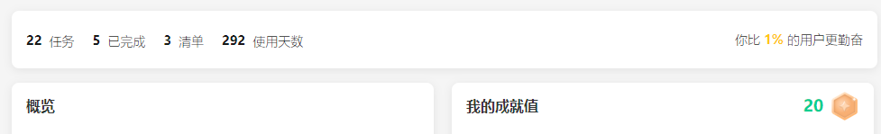
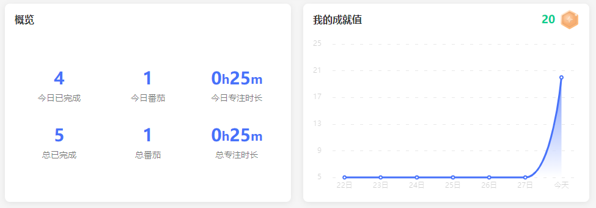
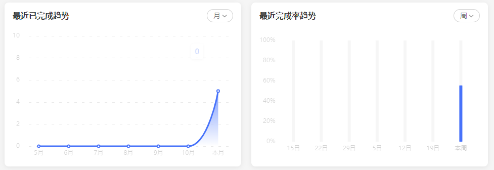
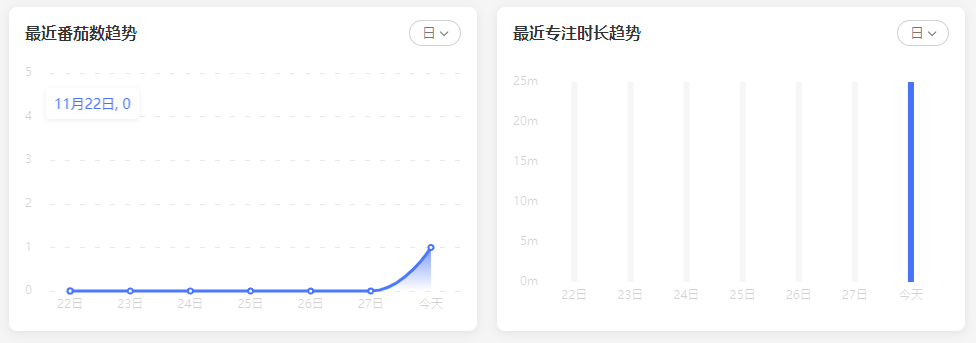
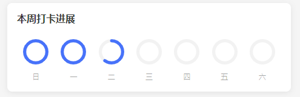

# 统计

## 总览

> https://api.dida365.com/api/v3/user/ranking

*请求的方式：GET*

成功响应：

```json
{
  "ranking": 1.72,
  "taskCount": 22,
  "projectCount": 3,
  "dayCount": 292,
  "completedCount": 5,
  "score": 20,
  "level": 1
}
```

响应字段说明：
|字段|值|作用|
|----|---|----|
|ranking|float|你比`ranking`%的用户更勤奋|
|taskCount|int|任务数量|
|projectCount|int|项目数|
|dayCount|int|使用天数|
|completedCount|int|已完成任务数|
|score|int|我的成就值|
|level|int|账号等级|



## 总览-概览/成就值/趋势

该接口包含以下6模块：






> https://api.dida365.com/api/v2/statistics/general

*请求的方式：GET*

成功响应：

```json
{
  "score": 20,
  "level": 1,
  "yesterdayCompleted": 1,
  "todayCompleted": 4,
  "totalCompleted": 5,
  "todayPomoCount": 1,
  "yesterdayPomoCount": 0,
  "totalPomoCount": 1,
  "todayPomoDuration": 25,
  "yesterdayPomoDuration": 0,
  "totalPomoDuration": 25,
  "pomoGoal": 4,
  "pomoDurationGoal": 0,
  "scoreByDay": {
    "20231122": 5,
    "20231123": 5,
    "20231124": 5,
    "20231125": 5,
    "20231126": 5,
    "20231127": 5,
    "20231128": 20
  },
  "taskByDay": {
    "20231122": {
      "completeCount": 0,
      "notCompleteCount": 0
    },
    "20231123": {
      "completeCount": 0,
      "notCompleteCount": 0
    },
    "20231124": {
      "completeCount": 0,
      "notCompleteCount": 0
    },
    "20231125": {
      "completeCount": 0,
      "notCompleteCount": 0
    },
    "20231126": {
      "completeCount": 0,
      "notCompleteCount": 0
    },
    "20231127": {
      "completeCount": 1,
      "notCompleteCount": 2
    },
    "20231128": {
      "completeCount": 4,
      "notCompleteCount": 0
    }
  },
  "taskByWeek": {
    "20231015": {
      "completeCount": 0,
      "notCompleteCount": 0
    },
    "20231022": {
      "completeCount": 0,
      "notCompleteCount": 0
    },
    "20231029": {
      "completeCount": 0,
      "notCompleteCount": 0
    },
    "20231105": {
      "completeCount": 0,
      "notCompleteCount": 0
    },
    "20231112": {
      "completeCount": 0,
      "notCompleteCount": 0
    },
    "20231119": {
      "completeCount": 0,
      "notCompleteCount": 0
    },
    "20231126": {
      "completeCount": 5,
      "notCompleteCount": 4
    }
  },
  "taskByMonth": {
    "20230501": {
      "completeCount": 0,
      "notCompleteCount": 0
    },
    "20230601": {
      "completeCount": 0,
      "notCompleteCount": 0
    },
    "20230701": {
      "completeCount": 0,
      "notCompleteCount": 0
    },
    "20230801": {
      "completeCount": 0,
      "notCompleteCount": 0
    },
    "20230901": {
      "completeCount": 0,
      "notCompleteCount": 0
    },
    "20231001": {
      "completeCount": 0,
      "notCompleteCount": 0
    },
    "20231101": {
      "completeCount": 5,
      "notCompleteCount": 3
    }
  },
  "pomoByDay": {
    "20231122": {
      "count": 0,
      "duration": 0
    },
    "20231123": {
      "count": 0,
      "duration": 0
    },
    "20231124": {
      "count": 0,
      "duration": 0
    },
    "20231125": {
      "count": 0,
      "duration": 0
    },
    "20231126": {
      "count": 0,
      "duration": 0
    },
    "20231127": {
      "count": 0,
      "duration": 0
    },
    "20231128": {
      "count": 1,
      "duration": 25
    }
  },
  "pomoByWeek": {
    "20231015": {
      "count": 0,
      "duration": 0
    },
    "20231022": {
      "count": 0,
      "duration": 0
    },
    "20231029": {
      "count": 0,
      "duration": 0
    },
    "20231105": {
      "count": 0,
      "duration": 0
    },
    "20231112": {
      "count": 0,
      "duration": 0
    },
    "20231119": {
      "count": 0,
      "duration": 0
    },
    "20231126": {
      "count": 1,
      "duration": 25
    }
  },
  "pomoByMonth": {
    "20230501": {
      "count": 0,
      "duration": 0
    },
    "20230601": {
      "count": 0,
      "duration": 0
    },
    "20230701": {
      "count": 0,
      "duration": 0
    },
    "20230801": {
      "count": 0,
      "duration": 0
    },
    "20230901": {
      "count": 0,
      "duration": 0
    },
    "20231001": {
      "count": 0,
      "duration": 0
    },
    "20231101": {
      "count": 1,
      "duration": 25
    }
  }
}
```

| 字段                           | 值 | 作用         |
|------------------------------|---|------------|
| score                        |   | 我的成就值(今天)  |
| level                        |   | 账号等级       |
| yesterdayCompleted           |   | 昨日完成任务数量   |
| todayCompleted               |   | 今日完成任务数量   |
| totalCompleted               |   | 总完成任务数量    |
| todayPomoCount               |   | 今日番茄       |
| yesterdayPomoCount           |   | 昨日番茄       |
| totalPomoCount               |   | 总番茄        |
| todayPomoDuration            |   | 今日专注时长     |
| yesterdayPomoDuration        |   | 昨日专注时长     |
| totalPomoDuration            |   | 总专注时长      |
| pomoGoal                     |   | 目标番茄数      |
| pomoDurationGoal             |   | 目标专注时长     |
| scoreByDay                   |   | 近7天的成就值    |
| taskByDay/completeCount      |   | 近7天已完成任务数量 |
| taskByDay/notCompleteCount   |   | 近7天未完成任务数量 |
| taskByWeek/completeCount     |   | 近7周已完成任务数量 |
| taskByWeek/notCompleteCount  |   | 近7周未完成任务数量 |
| taskByMonth/completeCount    |   | 近7月已完成任务数量 |
| taskByMonth/notCompleteCount |   | 近7月未完成任务数量 |
| pomoByDay/count              |   | 近7天番茄数     |
| pomoByDay/duration           |   | 近7天专注时长    |
| pomoByWeek/count             |   | 近7周番茄数     |
| pomoByWeek/duration          |   | 近7周专注时长    |
| pomoByMonth/count            |   | 近7月番茄数     |
| pomoByMonth/duration         |   | 近7月专注时长    |

完成率=已完成/(已完成+未完成)

## 总览-本周打卡进度


> https://api.dida365.com/api/v2/habits/statistics/week/current

*请求的方式：GET*

成功响应：

```json
{
  "20231126": {
    "totalHabitCount": 5,
    "completedHabitCount": 5
  },
  "20231127": {
    "totalHabitCount": 6,
    "completedHabitCount": 6
  },
  "20231128": {
    "totalHabitCount": 5,
    "completedHabitCount": 3
  },
  "20231129": {
    "totalHabitCount": 5,
    "completedHabitCount": 0
  },
  "20231130": {
    "totalHabitCount": 5,
    "completedHabitCount": 0
  },
  "20231201": {
    "totalHabitCount": 5,
    "completedHabitCount": 0
  },
  "20231202": {
    "totalHabitCount": 3,
    "completedHabitCount": 0
  }
}
```

| 字段                  | 值 | 作用      |
|---------------------|---|---------|
| totalHabitCount     |   | 总打卡数量   |
| completedHabitCount |   | 已完成打卡数量 |


## 任务


