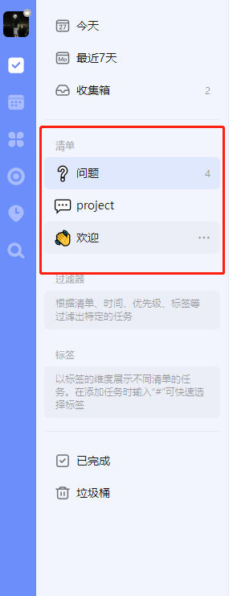

## 获取清单列表

> https://api.dida365.com/api/v2/projects

*请求方式：GET*

```json
[
    {
        "id": "63e459d1426870b89265cc2a",
        "name": "\uD83D\uDC4B欢迎",
        "isOwner": true,
        "color": null,
        "inAll": true,
        "sortOrder": -274877906944,
        "sortOption": {
            "groupBy": "sortOrder",
            "orderBy": "sortOrder"
        },
        "sortType": "sortOrder",
        "userCount": 1,
        "etag": "dobjhwoc",
        "modifiedTime": "2023-11-17T11:13:59.356+0000",
        "closed": null,
        "muted": false,
        "transferred": null,
        "groupId": null,
        "viewMode": null,
        "notificationOptions": [],
        "teamId": null,
        "permission": "write",
        "kind": "TASK",
        "timeline": {
            "range": null,
            "sortType": "sortOrder",
            "sortOption": {
                "groupBy": "sortOrder",
                "orderBy": "sortOrder"
            }
        },
        "needAudit": false,
        "openToTeam": null,
        "teamMemberPermission": null,
        "source": 1
    }
]
```


## 获取清单信息


> https://api.dida365.com/api/v2/batch/check/0

*请求方式: GET*

**响应json**

```json
{
  "checkPoint": 1701054529680,
  "syncTaskBean": {
    "update": [],
    "delete": [],
    "add": [],
    "empty": false
  },
  "projectProfiles": [
    {
      "id": "63e459d1426870b89265cc2a",
      "name": "👋欢迎",
      "isOwner": true,
      "color": null,
      "inAll": true,
      "sortOrder": -274877906944,
      "sortOption": {
        "groupBy": "sortOrder",
        "orderBy": "sortOrder"
      },
      "sortType": "sortOrder",
      "userCount": 1,
      "etag": "dobjhwoc",
      "modifiedTime": "2023-11-17T11:13:59.356+0000",
      "closed": null,
      "muted": false,
      "transferred": null,
      "groupId": null,
      "viewMode": null,
      "notificationOptions": [],
      "teamId": null,
      "permission": "write",
      "kind": "TASK",
      "timeline": {
        "range": null,
        "sortType": "sortOrder",
        "sortOption": {
          "groupBy": "sortOrder",
          "orderBy": "sortOrder"
        }
      },
      "needAudit": false,
      "openToTeam": null,
      "teamMemberPermission": null,
      "source": 1
    }
  ],
  "projectGroups": [],
  "filters": null,
  "tags": [],
  "syncTaskOrderBean": {
    "taskOrderByDate": {},
    "taskOrderByPriority": {},
    "taskOrderByProject": {}
  },
  "syncOrderBean": {
    "orderByType": {}
  },
  "syncOrderBeanV3": {
    "orderByType": {}
  },
  "inboxId": "inbox1022543562",
  "checks": null,
  "remindChanges": []
}
```

| 一级字段          | 二级/三级/四级字段          | 值                         | 作用                       |
| :---------------- | --------------------------- | -------------------------- | -------------------------- |
| checkPoint        |                             | 时间戳, 暂时没关注哪里来的 | 定时检查, 各个设备同步信息 |
| syncTaskBean      |                             |                            | 具体需要更新的数据         |
|                   | update                      |                            | 更新                       |
|                   | delete                      |                            | 删除                       |
|                   | add                         |                            | 新增                       |
|                   | empty                       | 上面三种情况为空, 则为true |                            |
| projectProfiles   |                             |                            | 清单                       |
|                   | id                          | 一堆字母和数字乱码         | 清单唯一标识符             |
|                   | name                        |                            | 清单名字                   |
|                   | isOwner                     | true/false                 | 拥有者                     |
|                   | color                       | null                       |                            |
|                   | inAll                       | true/false                 |                            |
|                   | sortOrder                   | 大负数                     | 自定义排序                 |
|                   | sortOption/groupBy          | `sortType`字段             |                            |
|                   | sortOption/orderBy          | `sortType`字段             |                            |
|                   | sortType                    | sortOrder/...              |                            |
|                   | userCount                   | 数字                       |                            |
|                   | etag                        |                            |                            |
|                   | modifiedTime                |                            | 修改时间                   |
|                   | closed                      |                            |                            |
|                   | muted                       |                            |                            |
|                   | transferred                 |                            | 翻译: 转移                 |
|                   | groupId                     |                            |                            |
|                   | viewMode                    | list/...                   |                            |
|                   | notificationOptions         |                            |                            |
|                   | teamId                      |                            |                            |
|                   | permission                  | write/...                  | 协同共享权限               |
|                   | kind                        | TASK/...                   |                            |
|                   | timeline                    |                            |                            |
|                   | timeline/range              |                            |                            |
|                   | timeline/sortType           |                            |                            |
|                   | timeline/sortOption/groupBy |                            |                            |
|                   | timeline/sortOption/orderBy |                            |                            |
|                   | needAudit                   |                            |                            |
|                   | openToTeam                  |                            |                            |
|                   | teamMemberPermission        |                            |                            |
|                   | source                      |                            |                            |
| projectGroups     |                             |                            | 文件夹                     |
| filters           |                             |                            | 过滤器                     |
| tags              |                             |                            | 标签                       |
| syncTaskOrderBean |                             |                            |                            |
|                   | taskOrderByDate             |                            |                            |
|                   | taskOrderByPriority         |                            |                            |
|                   | taskOrderByProject          |                            |                            |
| syncOrderBean     |                             |                            |                            |
|                   | orderByType                 |                            |                            |
| syncOrderBeanV3   |                             |                            |                            |
|                   | orderByType                 |                            |                            |
| inboxId           |                             |                            |                            |
| checks            |                             |                            |                            |
| remindChanges     |                             |                            |                            |

